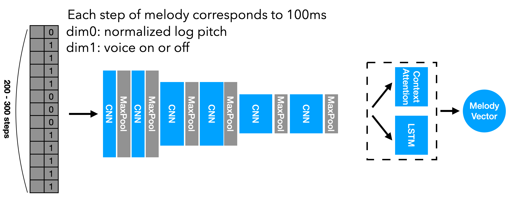

# Query-by-Humming with Melody Embedding DNN

This is an implementation of Query-by-Humming with melody embedding DNN by Dasaem Jeong @ T-Brain X, T3K, SK telecom. 

Pre-trained weight and humming data is available on [Google Drive](https://drive.google.com/drive/folders/1qrc5S2plEEQtMU_8RXmbG4q-enzqhadE?usp=sharing)

Contact: dasaem.jeong@sktbrain.com

---
## Singing Voice (Melody) Estimator
The singing voice estimation model was converted from Sangeun Kum's [Keras implementation](https://github.com/keums/melodyExtraction_SSL) of his research "*Semi-supervised learning using teacher-student models for vocal melody extraction*"[[pdf]](https://arxiv.org/abs/2008.06358).

The time resolution of the singing voice estimator is 10 ms. Therefore, it has to be downsampled to 100 ms before feeding it into the Melody Embedder.

---
## Melody Embedding
The melody embedding model takes a melody contour input in a size of (Batch X Length X 2), and encode it into embeddings in a size of (Batch X 512)

---
## Model Training

The model was trained by triplet loss of max hinge cosine similarity. Anchor is an original melody and positive samples are augmented version of anchor melody or humming melody. Negative samples are sampled from melody of other songs.

---
## Tutorial
A tutorial code in Jupyter Notebook is available in notebook/tutorial.ipynb
